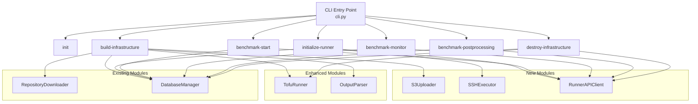

# Design Document: Additional Flows

## Overview

This design extends the KASBench Controller with the full benchmark lifecycle orchestration. The current system handles `init` and `build-infrastructure`. This enhancement adds:

1. **Modified `build-infrastructure`** — New options (`--aws-region`, `--s3-bucket`, `--run-duration`) and an S3 upload step after infrastructure provisioning.
2. **Enhanced output parser** — Extracts additional fields (control plane IP, worker IPs, NLB DNS/port) from tofu output.
3. **`initialize-runner` command** — Pulls the runner Docker image, creates the network, starts the container, waits for health, sends initialization config, waits for rollout, and takes a pre-benchmark snapshot.
4. **`benchmark-start` command** — Triggers load generation via the Runner API.
5. **`benchmark-monitor` command** — Polls the Runner API until the benchmark completes or times out.
6. **`benchmark-postprocessing` command** — Triggers shutdown and sequential data exports via the Runner API.
7. **`destroy-infrastructure` command** — Shuts down the runner, waits for EBS detachment, then runs `tofu destroy`.

Each command operates on a trial identified by `(working-directory, run-identifier, trial-identifier)` and uses the existing `RunContext`/`TrialContext` pattern to resolve paths.

## Architecture



### Design Decisions

1. **Trial configuration file** — Rather than passing all options through CLI args to every subsequent command, `build-infrastructure` writes a `trial_config.json` to the trial's output directory. Subsequent commands (`initialize-runner`, `benchmark-start`, etc.) load this config to retrieve `aws_region`, `s3_bucket`, `run_duration`, `benchmark_runner_public_ip`, and parsed tofu outputs. This decouples commands and avoids requiring the user to re-specify values.

2. **Runner API client as a thin wrapper** — The `RunnerAPIClient` class wraps `httpx` with the base URL (`http://{ip}:8080`), retry/timeout configuration, and structured error handling. Commands use it as a high-level interface rather than constructing HTTP requests directly.

3. **SSH via subprocess** — The `SSHExecutor` wraps `subprocess.run()` calls to `ssh` using the trial's private key and the benchmark runner's public IP. This follows the same pattern as `TofuRunner` (subprocess wrapper + structured result type). No SSH library dependency is needed since the operations are simple single-command executions.

4. **S3 via AWS CLI subprocess** — The `S3Uploader` wraps `subprocess.run()` calls to `aws s3 cp`. This avoids adding `boto3` as a dependency and keeps the pattern consistent with TofuRunner. The AWS CLI handles credentials via the standard chain (env vars, instance profile, etc.).

5. **TofuRunner gets a `destroy` method** — Follows the same pattern as `apply` but calls `tofu destroy` instead.

## Components and Interfaces

### New Module: `s3_uploader.py`

```python
@dataclass
class S3UploadResult:
    success: bool
    source_path: str
    destination_uri: str
    stderr: str

class S3Uploader:
    def __init__(self, bucket: str, region: str, dry_run: bool = False) -> None: ...
    
    def upload_file(self, local_path: Path, s3_key: str) -> S3UploadResult:
        """Upload a single file to s3://{bucket}/{s3_key} using aws s3 cp."""
        ...
    
    def upload_trial_artifacts(
        self,
        trial_ctx: TrialContext,
        run_identifier: str,
        trial_identifier: str,
    ) -> list[S3UploadResult]:
        """Upload standard trial artifacts (tofu_outputs.json, environment-description.json, environment-description.md)."""
        ...
```

**S3 path construction logic:**
- Source: `{trial_ctx.output_directory}/tofu_outputs.json`  
  Dest: `{run_identifier}/{trial_identifier}/infrastructure/tofu_outputs.json`
- Source: `{trial_ctx.tofu_directory}/artifacts/{trial_identifier}/environment-description.json`  
  Dest: `{run_identifier}/{trial_identifier}/infrastructure/environment-description.json`
- Source: `{trial_ctx.tofu_directory}/artifacts/{trial_identifier}/environment-description.md`  
  Dest: `{run_identifier}/{trial_identifier}/infrastructure/environment-description.md`

### New Module: `ssh_executor.py`

```python
@dataclass
class SSHResult:
    return_code: int
    stdout: str
    stderr: str
    success: bool

class SSHExecutor:
    def __init__(
        self,
        host: str,
        key_path: Path,
        user: str = "ubuntu",
        dry_run: bool = False,
    ) -> None: ...
    
    def execute(self, command: str, timeout: int = 120) -> SSHResult:
        """Execute a command on the remote host via SSH subprocess."""
        ...
```

The SSH command template:
```
ssh -i {key_path} -o StrictHostKeyChecking=no -o ConnectTimeout=10 {user}@{host} "{command}"
```

### New Module: `runner_api.py`

```python
class RunnerAPIClient:
    def __init__(self, base_url: str, timeout: float = 30.0) -> None: ...
    
    def health_check(self) -> bool:
        """GET /status — returns True if HTTP 200."""
        ...
    
    def initialize(self, config: dict) -> httpx.Response:
        """POST /initialize with the provided config body."""
        ...
    
    def rollout_wait(self, deployment_name: str, namespace: str, timeout: int) -> httpx.Response:
        """POST /rollout/wait."""
        ...
    
    def snapshot(self, phase: str) -> httpx.Response:
        """POST /snapshot with {"phase": phase}."""
        ...
    
    def start(self) -> httpx.Response:
        """POST /start with empty JSON body."""
        ...
    
    def status(self) -> httpx.Response:
        """GET /status — returns the full response for status parsing."""
        ...
    
    def shutdown(self) -> httpx.Response:
        """POST /shutdown."""
        ...
    
    def export(self, export_type: str) -> httpx.Response:
        """POST /{export_type}/export for metrics, metadata, tsdb, output, db."""
        ...
```

### Enhanced Module: `output_parser.py`

The `parse_tofu_outputs` function is extended to extract additional fields. The signature remains the same but `TofuOutputs` gains new fields.

### Enhanced Module: `tofu.py`

Add a `destroy` method to `TofuRunner`:

```python
def destroy(
    self,
    var_files: list[str],
    variables: list[str],
    run_id: str,
    auto_approve: bool,
) -> TofuResult:
    """Run `tofu destroy` with the specified variables."""
    ...
```

### New Commands

Each new command follows the existing pattern in `commands/`:
- `commands/initialize_runner.py`
- `commands/benchmark_start.py`
- `commands/benchmark_monitor.py`
- `commands/benchmark_postprocessing.py`
- `commands/destroy_infrastructure.py`

All commands accept `--working-directory`, `--run-identifier`, and `--trial-identifier` to construct `RunContext`/`TrialContext` and load the trial config.

### Trial Config Persistence

The `build-infrastructure` command writes a `trial_config.json` after a successful run:

```json
{
  "aws_region": "us-east-1",
  "s3_bucket": "my-bucket",
  "run_duration": 30,
  "benchmark_runner_public_ip": "1.2.3.4",
  "ssh_key_pair_name": "kasbench-trial001",
  "control_plane_private_ip": "10.0.2.206",
  "amd_worker_private_ips": ["10.0.2.116"],
  "arm_worker_private_ips": ["10.0.2.4"],
  "globeco_dns": "kasb-xxx.elb.us-east-1.amazonaws.com",
  "globeco_port": 80
}
```

A helper function `load_trial_config(trial_ctx: TrialContext) -> dict` reads this file and raises `KasbenchError` if it doesn't exist (indicating `build-infrastructure` hasn't completed).

## Data Models

### Enhanced `TofuOutputs`

```python
@dataclass
class TofuOutputs:
    """Parsed outputs from tofu output -json."""

    benchmark_runner_public_ip: str | None
    ssh_key_pair_name: str | None
    control_plane_private_ip: str | None
    amd_worker_private_ips: list[str]
    arm_worker_private_ips: list[str]
    globeco_dns: str | None
    globeco_port: int | None
    raw_json: dict
```

### Trial Config (new dataclass)

```python
@dataclass
class TrialConfig:
    """Persisted trial configuration loaded by subsequent commands."""

    aws_region: str
    s3_bucket: str
    run_duration: int
    benchmark_runner_public_ip: str
    ssh_key_pair_name: str
    control_plane_private_ip: str
    amd_worker_private_ips: list[str]
    arm_worker_private_ips: list[str]
    globeco_dns: str
    globeco_port: int
```

### New Exceptions

```python
class S3UploadError(KasbenchError):
    """S3 upload operation failed."""
    def __init__(self, message: str, file_path: str = "", stderr: str = "") -> None: ...

class SSHError(KasbenchError):
    """SSH command execution failed."""
    def __init__(self, message: str, command: str = "", stderr: str = "", return_code: int = 1) -> None: ...

class RunnerAPIError(KasbenchError):
    """Runner API request failed."""
    def __init__(self, message: str, endpoint: str = "", status_code: int | None = None, response_body: str = "") -> None: ...

class TimeoutError(KasbenchError):
    """Operation timed out."""
    def __init__(self, message: str, operation: str = "", elapsed: float = 0.0) -> None: ...
```

### Database Schema Extensions

The existing schema is sufficient. The `trials` table already has all needed timestamp columns (`infra_start_time`, `infra_end_time`, `benchmark_start_time`, `benchmark_end_time`, `cleanup_start_time`, `cleanup_end_time`). Events are recorded in the existing `events` table.

New `DatabaseManager` methods needed:

```python
def update_trial_status(self, trial_id: int, status: str) -> None: ...
def record_benchmark_start_time(self, trial_id: int) -> None: ...
def record_benchmark_end_time(self, trial_id: int) -> None: ...
def record_infra_end_time(self, trial_id: int) -> None: ...
def record_cleanup_start_time(self, trial_id: int) -> None: ...
def record_cleanup_end_time(self, trial_id: int) -> None: ...
def insert_event(self, trial_id: int, event_type: str, event_message: str, event_request: str | None = None) -> int: ...
def get_trial_by_identifiers(self, run_identifier: str, trial_identifier: str) -> dict | None: ...
```

### Command Flow: How Trial Context Flows Between Commands

```mermaid
sequenceDiagram
    participant User
    participant init
    participant build as build-infrastructure
    participant initr as initialize-runner
    participant start as benchmark-start
    participant monitor as benchmark-monitor
    participant post as benchmark-postprocessing
    participant destroy as destroy-infrastructure

    User->>init: --working-dir --run-identifier
    Note over init: Creates run_dir/, benchmark.db

    User->>build: --working-dir --run-id --trial-id --autoscaler<br/>--aws-region --s3-bucket --run-duration
    Note over build: Creates trial_dir/<br/>Downloads repo, tofu apply<br/>Uploads to S3<br/>Writes trial_config.json

    User->>initr: --working-dir --run-id --trial-id
    Note over initr: Loads trial_config.json<br/>SSH: docker pull, network, run<br/>API: /status, /initialize, /rollout/wait, /snapshot

    User->>start: --working-dir --run-id --trial-id
    Note over start: Loads trial_config.json<br/>API: POST /start

    User->>monitor: --working-dir --run-id --trial-id<br/>--timeout --interval --verbose
    Note over monitor: Loads trial_config.json<br/>Polls GET /status until terminal

    User->>post: --working-dir --run-id --trial-id
    Note over post: Loads trial_config.json<br/>API: /shutdown, exports

    User->>destroy: --working-dir --run-id --trial-id<br/>--auto-approve --var-file --var
    Note over destroy: Loads trial_config.json<br/>API: /shutdown, wait EBS<br/>tofu destroy
```

## Correctness Properties

*A property is a characteristic or behavior that should hold true across all valid executions of a system — essentially, a formal statement about what the system should do. Properties serve as the bridge between human-readable specifications and machine-verifiable correctness guarantees.*

### Property 1: S3 path construction correctness

*For any* valid `run_identifier` and `trial_identifier` strings and any of the three standard artifact types (tofu_outputs.json, environment-description.json, environment-description.md), the S3 destination key SHALL be `{run_identifier}/{trial_identifier}/infrastructure/{filename}` and the local source path SHALL resolve to the correct location within the trial directory structure.

**Validates: Requirements 4.1, 4.2, 4.3**

### Property 2: Output parser extracts all fields correctly

*For any* valid tofu output JSON dictionary containing `benchmark_runner`, `control_plane`, `worker_nodes`, `nlb`, and `ssh_key_pair_name` structures, `parse_tofu_outputs` SHALL return a `TofuOutputs` instance where each field matches the corresponding value at the expected JSON path, all worker IP lists preserve order, and `globeco_port` is an integer.

**Validates: Requirements 5.1, 5.2, 5.3, 5.4, 5.5**

### Property 3: Output parser reports all missing keys

*For any* subset of required keys omitted from the tofu output JSON, `parse_tofu_outputs` SHALL raise a `ValidationError` whose message contains exactly the names of the missing keys and no others.

**Validates: Requirements 5.6**

### Property 4: Initialize request body construction correctness

*For any* valid `TrialConfig` containing an IP address, lists of worker IPs, S3 bucket name, DNS name, port, run/trial identifiers, and run duration, the constructed JSON body for `POST /initialize` SHALL contain all required fields (`autoscaler`, `controlPlaneNode`, `amdWorkerNodes`, `armWorkerNodes`, `s3Bucket`, `globecoUrl`, `globecoPort`, `runIdentifier`, `trialIdentifier`, `runDurationMinutes`, `skipKubernetesInstall`, `skipManifestInstall`, `forceManifestInstall`) with values matching the config, `globecoUrl` formatted as `http://{globeco_dns}`, and `globecoPort` as an integer.

**Validates: Requirements 11.1**

### Property 5: Export error identifies failed step

*For any* export step in the ordered sequence (metrics, metadata, tsdb, output, db), if that step returns a non-200 status code, the resulting error message SHALL contain the name of the failed export type and no other export type names.

**Validates: Requirements 19.6**

## Error Handling

All commands follow the established pattern:

1. **Structured exception hierarchy** — Each new module has its own exception type inheriting from `KasbenchError` (`S3UploadError`, `SSHError`, `RunnerAPIError`, `TimeoutError`).

2. **Command-level catch** — Each command function wraps its logic in `try/except KasbenchError` + `except Exception`, logs the error via `log_step`, and exits with code 1.

3. **Retry strategies**:
   - **S3 uploads**: No retry (AWS CLI handles transient retries internally).
   - **SSH commands**: No retry (single attempt; the user can re-run the command).
   - **Runner API health check**: Polling with configurable timeout (not a retry, but a wait loop).
   - **Runner API requests**: Single attempt with httpx timeout. Failures are immediately fatal.

4. **Timeout handling**:
   - Health check polling: Default 30s, configurable.
   - Rollout wait polling: Default 10 min, configurable.
   - Benchmark monitor: Configurable `--timeout` option.
   - EBS wait: Configurable, default 5 min.

5. **Dry-run mode** — All new commands support `--dry-run` (inherited from the CLI group context). In dry-run mode, they log planned operations without executing them and exit 0.

## Testing Strategy

### Unit Tests (pytest)

Unit tests cover:
- CLI option registration and defaults for all commands
- Error conditions (missing required options, prerequisite checks)
- `S3Uploader.upload_trial_artifacts` path construction (mocked subprocess)
- `SSHExecutor.execute` command construction (mocked subprocess)
- `RunnerAPIClient` request construction (mocked httpx via `respx`)
- `parse_tofu_outputs` with various valid and invalid inputs
- `load_trial_config` with valid/missing config files
- `TofuRunner.destroy` argument assembly (mocked subprocess)
- Each command's dry-run output

### Property-Based Tests (Hypothesis)

The project already includes `hypothesis>=6.100` in dev dependencies. Property-based tests will validate the correctness properties defined above:

- **Property 1**: Generate random `run_identifier` and `trial_identifier` strings (alphanumeric, valid path components), verify S3 key construction.
- **Property 2**: Generate random valid tofu output JSON dictionaries with randomized IPs, DNS names, ports, and worker lists, verify all fields are extracted correctly.
- **Property 3**: Generate random subsets of required keys to omit, verify error message contains exactly those key names.
- **Property 4**: Generate random `TrialConfig` instances with randomized IPs, ports, identifiers, verify the constructed request body contains all fields with correct values.
- **Property 5**: For each of the 5 export types, verify error message specificity.

Each property test runs a minimum of 100 iterations. Tests are tagged with comments referencing the design property:
```python
# Feature: additional-flows, Property 2: Output parser extracts all fields correctly
```

### Integration Tests

Integration tests (using mocked external dependencies) cover:
- Full `build-infrastructure` flow with new options and S3 upload step
- Full `initialize-runner` flow (mocked SSH + mocked HTTP)
- Full `benchmark-start` → `benchmark-monitor` → `benchmark-postprocessing` flow
- Full `destroy-infrastructure` flow
- Database state transitions across the lifecycle
- Event audit trail completeness
