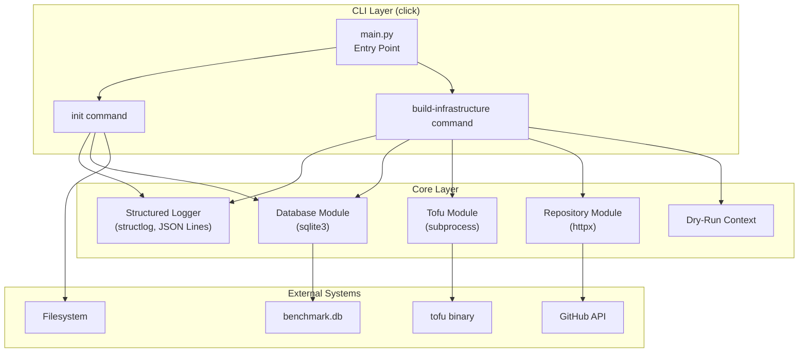
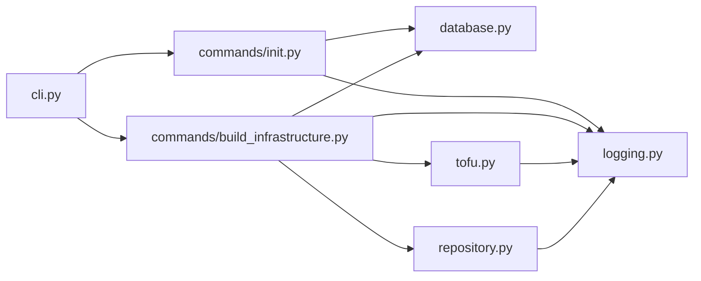
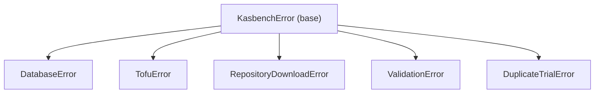

# Design Document: Baseline Development

## Overview

The KASBench Controller is a Python 3.13+ CLI application that orchestrates Kubernetes autoscaling benchmark execution from a Bastion Host. This baseline development covers two core flows: `init` (initializing a new experimental run with a SQLite database) and `build-infrastructure` (provisioning AWS infrastructure for a benchmark trial via Open Tofu).

The application is structured as a Python package using `uv` as the package manager, with `click` as the CLI framework. It calls `tofu` directly via subprocess (not TofuPy), uses SQLite for trial metadata persistence, and emits structured JSON Lines logging for auditability.

### Key Design Decisions

| Decision | Choice | Rationale |
|----------|--------|-----------|
| CLI Framework | `click` | Mature, well-documented, supports subcommands, argument validation, and prompts natively. Lighter than typer (no pydantic dependency). |
| Logging Format | JSON Lines (structlog) | Machine-parseable, supports streaming, each line is a self-contained JSON object with timestamp. |
| Database | SQLite via `sqlite3` stdlib | No external dependency needed. Runs locally on Bastion Host. Single-writer model fits the use case. |
| Tofu Integration | `subprocess.run()` | Direct, transparent, captures stdout/stderr. No third-party wrapper needed. |
| Repository Download | `httpx` + zipball API | GitHub provides zipball URLs for branches. Avoids git dependency. Supports timeouts and retries natively. |
| Output Parsing | `tofu output -json` | Produces well-structured JSON. Avoids writing a custom HCL parser. |
| Package Structure | `src/kasbench_controller/` | src-layout per Python packaging best practices. |

## Architecture



### Module Dependency Flow



## Components and Interfaces

### Package Structure

```
src/
└── kasbench_controller/
    ├── __init__.py
    ├── cli.py                  # Click group and global options
    ├── commands/
    │   ├── __init__.py
    │   ├── init.py             # init subcommand implementation
    │   └── build_infrastructure.py  # build-infrastructure subcommand
    ├── database.py             # SQLite schema management and operations
    ├── tofu.py                 # Open Tofu subprocess wrapper
    ├── repository.py           # GitHub repository download
    ├── logging.py              # Structured logging setup (structlog)
    ├── models.py               # Data classes for domain objects
    └── exceptions.py           # Custom exception hierarchy
```

### CLI Module (`cli.py`)

The entry point defines a Click group with global options shared across subcommands.

```python
import click
from kasbench_controller.commands import init, build_infrastructure

@click.group()
@click.option("--log", type=click.Path(), default=None, help="Write structured logs to file")
@click.option("--dry-run", is_flag=True, default=False, help="Report operations without executing")
@click.pass_context
def cli(ctx: click.Context, log: str | None, dry_run: bool) -> None:
    """KASBench Controller - Kubernetes Autoscaling Benchmark Orchestrator."""
    ctx.ensure_object(dict)
    ctx.obj["log_file"] = log
    ctx.obj["dry_run"] = dry_run

cli.add_command(init.init_cmd)
cli.add_command(build_infrastructure.build_infrastructure_cmd)
```

### Init Command (`commands/init.py`)

```python
@click.command("init")
@click.option("--working-directory", required=True, type=click.Path())
@click.option("--run-identifier", required=True, type=str)
@click.option("--force", is_flag=True, default=False)
@click.pass_context
def init_cmd(ctx: click.Context, working_directory: str, run_identifier: str, force: bool) -> None:
    ...
```

### Build-Infrastructure Command (`commands/build_infrastructure.py`)

```python
@click.command("build-infrastructure")
@click.option("--working-directory", required=True, type=click.Path())
@click.option("--run-identifier", required=True, type=str)
@click.option("--trial-identifier", required=True, type=str)
@click.option("--autoscaler", required=True, type=str)
@click.option("--auto-approve", is_flag=True, default=False)
@click.option("--var-file", multiple=True, type=str)
@click.option("--var", "variables", multiple=True, type=str)
@click.option("--force", is_flag=True, default=False)
@click.option("--no-apply", is_flag=True, default=False)
@click.pass_context
def build_infrastructure_cmd(ctx: click.Context, ...) -> None:
    ...
```

### Database Module (`database.py`)

```python
from pathlib import Path
import sqlite3
from dataclasses import dataclass
from datetime import datetime

VALID_STATUSES = ("PENDING", "INIT", "RUNNING", "CLEANUP", "SUCCESS", "FAIL", "TERMINATED", "UNKNOWN")

@dataclass
class TrialRecord:
    trial_id: int
    status: str
    run_identifier: str | None
    trial_identifier: str | None
    autoscaler: str
    record_created_time: datetime
    benchmark_runner_public_ip: str | None
    ssh_key_pair_name: str | None
    last_update_time: datetime
    infra_start_time: datetime | None
    infra_end_time: datetime | None
    # ... remaining fields

class DatabaseManager:
    def __init__(self, db_path: Path) -> None: ...
    def create_schema(self) -> None: ...
    def verify_schema(self) -> bool: ...
    def insert_trial(self, run_identifier: str, trial_identifier: str, autoscaler: str) -> int: ...
    def update_trial_after_apply(self, trial_id: int, public_ip: str, key_pair_name: str) -> None: ...
    def check_duplicate_trial(self, run_identifier: str, trial_identifier: str) -> bool: ...
```

### Tofu Module (`tofu.py`)

```python
from pathlib import Path
from dataclasses import dataclass

@dataclass
class TofuResult:
    return_code: int
    stdout: str
    stderr: str
    success: bool

class TofuRunner:
    def __init__(self, working_dir: Path, dry_run: bool = False) -> None: ...
    def init(self) -> TofuResult: ...
    def plan(self, var_files: list[str], variables: list[str], run_id: str) -> TofuResult: ...
    def apply(self, var_files: list[str], variables: list[str], run_id: str, auto_approve: bool) -> TofuResult: ...
    def output_json(self) -> dict: ...
    def _resolve_var_file(self, var_file: str) -> Path: ...
    def _build_var_args(self, var_files: list[str], variables: list[str], run_id: str) -> list[str]: ...
    def _run(self, args: list[str]) -> TofuResult: ...
```

### Repository Module (`repository.py`)

```python
from pathlib import Path

class RepositoryDownloader:
    REPO_URL = "https://github.com/kasbench/benchmark-infrastructure"
    ZIPBALL_URL = "https://github.com/kasbench/benchmark-infrastructure/archive/refs/heads/main.zip"
    TIMEOUT_SECONDS = 120
    MAX_RETRIES = 3
    RETRY_DELAY_SECONDS = 5

    CLEANUP_ITEMS = [".kiro", "requirements", ".gitignore", ".git"]

    def __init__(self, target_dir: Path, dry_run: bool = False) -> None: ...
    def download_and_extract(self) -> None: ...
    def _cleanup_unwanted_files(self) -> None: ...
```

### Logging Module (`logging.py`)

```python
import structlog
from pathlib import Path

def configure_logging(log_file: Path | None = None, dry_run: bool = False) -> structlog.BoundLogger:
    """Configure structlog for JSON Lines output to stdout and optionally a file."""
    ...

def log_step(logger: structlog.BoundLogger, step: str, outcome: str, **kwargs) -> None:
    """Emit a structured log entry for an operational step."""
    ...

def log_dry_run(logger: structlog.BoundLogger, operation: str, details: dict) -> None:
    """Emit a dry-run log entry describing what would be performed."""
    ...
```

### Exceptions Module (`exceptions.py`)

```python
class KasbenchError(Exception):
    """Base exception for all KASBench Controller errors."""
    pass

class DatabaseError(KasbenchError):
    """Database operation failed."""
    pass

class TofuError(KasbenchError):
    """Open Tofu command failed."""
    def __init__(self, message: str, stdout: str = "", stderr: str = "", return_code: int = 1): ...

class RepositoryDownloadError(KasbenchError):
    """Repository download failed."""
    def __init__(self, message: str, url: str = "", status_code: int | None = None, elapsed: float = 0.0): ...

class ValidationError(KasbenchError):
    """Input validation failed."""
    pass

class DuplicateTrialError(KasbenchError):
    """Trial with same run_identifier and trial_identifier already exists."""
    pass
```

### Dry-Run Implementation

Dry-run is implemented as a context flag passed through the Click context. Each module checks the flag before performing side effects:

```python
# Pattern used in each module
class TofuRunner:
    def __init__(self, working_dir: Path, dry_run: bool = False):
        self._dry_run = dry_run

    def init(self) -> TofuResult:
        if self._dry_run:
            log_dry_run(self._logger, "tofu init", {"cwd": str(self._working_dir)})
            return TofuResult(return_code=0, stdout="", stderr="", success=True)
        return self._run(["tofu", "init"])
```

For the `init` command in dry-run mode, the controller reports:
1. Would create working directory (if needed)
2. Would create/recreate run directory
3. Would create benchmark.db with schema

For `build-infrastructure` in dry-run mode:
1. Would validate run directory and database
2. Would create trial directory
3. Would download repository from GitHub
4. Would insert trial record
5. Would run `tofu init`
6. Would run `tofu apply` with specified arguments
7. Would capture outputs and update database

## Data Models

### SQLite Schema

```sql
CREATE TABLE IF NOT EXISTS trials (
    trial_id INTEGER PRIMARY KEY AUTOINCREMENT,
    status TEXT NOT NULL DEFAULT 'PENDING'
        CHECK (status IN ('PENDING', 'INIT', 'RUNNING', 'CLEANUP', 'SUCCESS', 'FAIL', 'TERMINATED', 'UNKNOWN')),
    run_identifier TEXT,
    trial_identifier TEXT,
    autoscaler TEXT NOT NULL,
    record_created_time DATETIME NOT NULL DEFAULT (strftime('%Y-%m-%dT%H:%M:%SZ', 'now')),
    benchmark_runner_public_ip TEXT,
    ssh_key_pair_name TEXT,
    last_update_time DATETIME NOT NULL DEFAULT (strftime('%Y-%m-%dT%H:%M:%SZ', 'now')),
    infra_start_time DATETIME,
    infra_end_time DATETIME,
    cleanup_start_time DATETIME,
    cleanup_end_time DATETIME,
    benchmark_start_time DATETIME,
    benchmark_end_time DATETIME,
    unresponsive_checks INTEGER NOT NULL DEFAULT 0
);

CREATE TABLE IF NOT EXISTS events (
    event_id INTEGER PRIMARY KEY AUTOINCREMENT,
    trial_id INTEGER NOT NULL,
    event_time DATETIME NOT NULL DEFAULT (strftime('%Y-%m-%dT%H:%M:%SZ', 'now')),
    event_type TEXT NOT NULL,
    event_request TEXT,
    event_message TEXT,
    FOREIGN KEY (trial_id) REFERENCES trials(trial_id)
);
```

### Structured Log Entry Format (JSON Lines)

Each log line is a self-contained JSON object:

```json
{"timestamp": "2026-06-01T10:30:00Z", "level": "info", "step": "create_run_directory", "outcome": "success", "path": "/data/run001"}
{"timestamp": "2026-06-01T10:30:01Z", "level": "info", "step": "create_database", "outcome": "success", "path": "/data/run001/benchmark.db"}
{"timestamp": "2026-06-01T10:30:02Z", "level": "error", "step": "tofu_apply", "outcome": "failure", "error": "Exit code 1", "stderr": "..."}
```

### Open Tofu JSON Output Structure

When using `tofu output -json`, the output is a JSON object where each key maps to an output value with metadata:

```json
{
  "benchmark_runner": {
    "value": {
      "ami_id": "ami-0e9bb5aa03403fb04",
      "architecture": "amd64",
      "instance_id": "i-06350b695b043ead2",
      "instance_type": "t3.small",
      "private_ip": "10.0.1.156",
      "public_ip": "174.129.166.9",
      "root_volume_id": "vol-0ce3692555e86e8d9",
      "subnet_id": "subnet-0ea11172485b39b3a"
    },
    "type": ["object", {...}],
    "sensitive": false
  },
  "ssh_key_pair_name": {
    "value": "kasbench-trial001",
    "type": "string",
    "sensitive": false
  }
}
```

The Controller extracts values via:
- `output["benchmark_runner"]["value"]["public_ip"]` → benchmark runner public IP
- `output["ssh_key_pair_name"]["value"]` → SSH key pair name

### Domain Data Classes (`models.py`)

```python
from dataclasses import dataclass, field
from datetime import datetime
from pathlib import Path

@dataclass
class RunContext:
    """Context for a benchmark run, shared across commands."""
    working_directory: Path
    run_identifier: str
    run_directory: Path = field(init=False)
    db_path: Path = field(init=False)

    def __post_init__(self):
        self.run_directory = self.working_directory / self.run_identifier
        self.db_path = self.run_directory / "benchmark.db"

@dataclass
class TrialContext:
    """Context for a single trial within a run."""
    run_context: RunContext
    trial_identifier: str
    autoscaler: str
    trial_directory: Path = field(init=False)
    tofu_directory: Path = field(init=False)
    output_directory: Path = field(init=False)

    def __post_init__(self):
        self.trial_directory = self.run_context.run_directory / self.trial_identifier
        self.tofu_directory = self.trial_directory / "benchmark-infrastructure"
        self.output_directory = self.trial_directory / "output"

@dataclass
class TofuOutputs:
    """Parsed outputs from tofu output -json."""
    benchmark_runner_public_ip: str
    ssh_key_pair_name: str
    raw_json: dict
```


## Correctness Properties

*A property is a characteristic or behavior that should hold true across all valid executions of a system—essentially, a formal statement about what the system should do. Properties serve as the bridge between human-readable specifications and machine-verifiable correctness guarantees.*

### Property 1: Structured log entries contain required fields

*For any* operational step logged by the Controller, the emitted JSON Lines entry SHALL be valid JSON and SHALL contain at minimum an ISO 8601 UTC timestamp field, a step description field, and an outcome field.

**Validates: Requirements 1.2**

### Property 2: Path construction is deterministic joining

*For any* valid working directory path and identifier string (run identifier or trial identifier), the constructed directory path SHALL always equal the parent path joined with the identifier using the OS path separator.

**Validates: Requirements 2.3, 4.7**

### Property 3: Status column constraint enforcement

*For any* string value attempted as a status in the trials table, the database SHALL accept the value if and only if it is one of: PENDING, INIT, RUNNING, CLEANUP, SUCCESS, FAIL, TERMINATED, UNKNOWN. All other string values SHALL be rejected.

**Validates: Requirements 3.4**

### Property 4: Zip extraction strips top-level directory prefix

*For any* zip archive containing a single top-level directory (as GitHub zipballs produce), extraction SHALL place all contents directly in the target directory without the intermediate directory level.

**Validates: Requirements 5.2**

### Property 5: Trial record insertion preserves provided values

*For any* valid combination of run_identifier, trial_identifier, and autoscaler string, inserting a trial record and then reading it back SHALL yield a record where run_identifier, trial_identifier, and autoscaler match the provided values, status is "PENDING", and record_created_time and last_update_time are set to timestamps within 1 second of the insertion time.

**Validates: Requirements 6.1**

### Property 6: Duplicate trial detection

*For any* pair of (run_identifier, trial_identifier), inserting a trial record with that pair a second time SHALL always fail with a duplicate trial error, regardless of the autoscaler value.

**Validates: Requirements 6.3**

### Property 7: Tofu command argument ordering

*For any* list of var-file paths and variable assignments, the constructed `tofu apply` command SHALL always order arguments as: var-file arguments (in input order), then var arguments (in input order), then the `run_id` variable last.

**Validates: Requirements 8.2**

### Property 8: Var-file path resolution

*For any* var-file argument string, if the string contains no path separator character, the resolved path SHALL equal the Open_Tofu_Directory / "environments" / filename. If the string contains a path separator, the resolved path SHALL equal the string as provided.

**Validates: Requirements 8.3**

### Property 9: infra_end_time remains NULL after build-infrastructure

*For any* successful build-infrastructure execution, the trial database record SHALL have `infra_end_time` set to NULL upon completion of the command.

**Validates: Requirements 8.10, 9.6**

### Property 10: JSON output value extraction round-trip

*For any* valid `tofu output -json` structure containing a `benchmark_runner` object with a `public_ip` string value and a `ssh_key_pair_name` string value, parsing the JSON and extracting these values SHALL return strings identical to the original values placed in the structure.

**Validates: Requirements 9.3, 9.4, 10.1, 10.2, 10.3**

### Property 11: Missing key error identification

*For any* JSON output structure that is missing one or more of the required keys (`benchmark_runner.public_ip`, `ssh_key_pair_name`), the error message SHALL identify each missing key by name.

**Validates: Requirements 9.5, 10.4**

### Property 12: Sensitive marker handling

*For any* HCL output containing `<sensitive>` as a value marker, the parser SHALL represent that value as None/null and SHALL NOT raise a parse error.

**Validates: Requirements 10.6**

## Error Handling

### Error Handling Strategy

The application uses a hierarchical exception model with structured error reporting:



### Error Propagation Pattern

1. **Module-level exceptions**: Each module raises its specific exception type with context (e.g., `TofuError` includes stdout, stderr, return code).
2. **Command-level handling**: Each Click command catches `KasbenchError` subclasses, logs the structured error, and calls `sys.exit(1)`.
3. **Unexpected exceptions**: A top-level handler catches all unhandled exceptions, logs them as structured errors with traceback, and exits with code 1.

```python
# Pattern in command handlers
@click.command("init")
@click.pass_context
def init_cmd(ctx, ...):
    logger = configure_logging(ctx.obj["log_file"], ctx.obj["dry_run"])
    try:
        # ... command logic ...
        log_step(logger, "init_complete", "success")
        sys.exit(0)
    except KasbenchError as e:
        log_step(logger, "init_failed", "failure", error=str(e), context=e.__class__.__name__)
        sys.exit(1)
    except Exception as e:
        log_step(logger, "unexpected_error", "failure", error=str(e), traceback=traceback.format_exc())
        sys.exit(1)
```

### Error Context Requirements

Each error log entry includes:
- `timestamp`: ISO 8601 UTC
- `level`: "error"
- `step`: The operation that failed (e.g., "tofu_apply", "create_database")
- `outcome`: "failure"
- `error`: Human-readable error description
- `context`: Additional context (file paths, return codes, stderr output)

### Retry Strategy

Only the repository download implements retries:
- Max 3 attempts
- 5-second delay between attempts
- Only retries on transient network errors (connection timeout, connection reset, 5xx status codes)
- Non-retryable errors (404, 403) fail immediately

### Filesystem Error Handling

- All directory creation uses `Path.mkdir(parents=True, exist_ok=False)` to detect conflicts
- Directory deletion uses `shutil.rmtree()` with error handling
- File write operations use atomic write patterns where possible (write to temp, then rename)

## Testing Strategy

### Testing Approach

The testing strategy uses a dual approach:

1. **Property-based tests** (using `hypothesis`): Verify universal properties across generated inputs. Minimum 100 iterations per property.
2. **Unit tests** (using `pytest`): Verify specific examples, edge cases, integration points, and error conditions.
3. **Integration tests** (using `pytest`): Verify end-to-end flows with mocked external dependencies (subprocess, network).

### Property-Based Testing Configuration

- Library: `hypothesis` (Python's standard PBT library)
- Minimum iterations: 100 per property (via `@settings(max_examples=100)`)
- Each property test references its design document property via tag comment

Tag format: `# Feature: baseline-development, Property {number}: {property_text}`

### Test Organization

```
tests/
├── conftest.py                    # Shared fixtures (temp dirs, mock databases)
├── test_logging.py                # Property 1 + unit tests for logging
├── test_path_construction.py      # Property 2 + unit tests for path logic
├── test_database.py               # Properties 3, 5, 6, 9 + unit tests for schema/operations
├── test_repository.py             # Property 4 + unit tests for download/extraction
├── test_tofu.py                   # Properties 7, 8 + unit tests for subprocess wrapper
├── test_output_parsing.py         # Properties 10, 11, 12 + unit tests for JSON/HCL parsing
├── test_init_command.py           # Integration tests for init flow
└── test_build_infrastructure.py   # Integration tests for build-infrastructure flow
```

### Key Test Fixtures

```python
@pytest.fixture
def tmp_working_dir(tmp_path):
    """Provides a temporary working directory for tests."""
    return tmp_path / "working"

@pytest.fixture
def initialized_run(tmp_working_dir):
    """Provides an initialized run directory with benchmark.db."""
    ...

@pytest.fixture
def mock_tofu_runner():
    """Provides a mocked TofuRunner that returns configurable results."""
    ...

@pytest.fixture
def sample_tofu_output_json():
    """Provides a sample tofu output -json structure."""
    ...
```

### Mocking Strategy

- **Subprocess calls**: Mock `subprocess.run` for tofu commands. Tests verify correct arguments are passed.
- **Network calls**: Mock `httpx` responses for repository download. Tests verify retry logic and error handling.
- **Filesystem**: Use `tmp_path` fixture for real filesystem operations in isolated temp directories.
- **Database**: Use real SQLite in-memory or temp file databases (fast enough, no mocking needed).

### Dependencies for Testing

```toml
[tool.uv.dev-dependencies]
pytest = ">=8.0"
hypothesis = ">=6.100"
pytest-mock = ">=3.12"
respx = ">=0.21"  # httpx mocking
```
