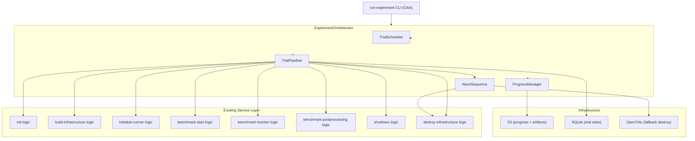
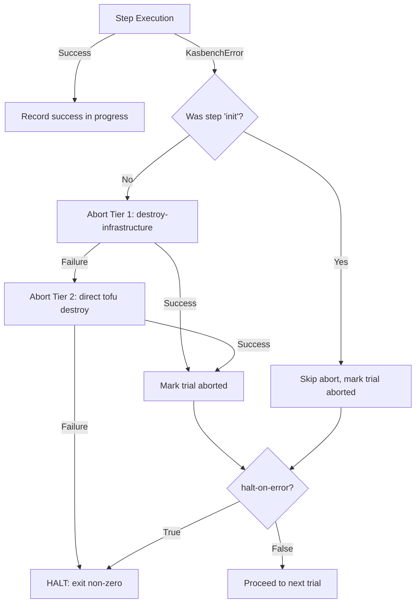

# Design Document: run-experiment

## Overview

The `run-experiment` command is a top-level orchestrator that automates the execution of multi-trial Kubernetes autoscaler benchmarks. It wraps the existing single-trial CLI commands (`init`, `build-infrastructure`, `initialize-runner`, `benchmark-start`, `benchmark-monitor`, `benchmark-postprocessing`, `shutdown`, `destroy-infrastructure`) into a single invocation that manages trial scheduling, error recovery, progress persistence, and resumption.

The command generates a randomized schedule assigning autoscalers to trials, then executes each trial sequentially through the full benchmark lifecycle. Progress is persisted to S3 after each step, enabling resumption from failures. An abort sequence ensures infrastructure cleanup on trial failure, with a two-tier fallback (destroy-infrastructure → direct tofu destroy) to prevent resource leakage.

## Architecture



### Design Decision: Service Layer vs. Direct Click Function Calls

**Decision: Extract reusable logic into a shared service layer.**

Each existing Click command currently embeds all its logic directly in the command function. The orchestrator will NOT call Click commands via `ctx.invoke()` or subprocess because:

1. Click commands call `sys.exit()` on both success and failure, which would terminate the orchestrator.
2. Click commands handle their own logging context and dry-run mode, creating coupling to the CLI layer.
3. Error handling in Click commands catches all exceptions and converts them to exit codes, losing structured error information the orchestrator needs.

Instead, the design extracts the core logic of each command into **service functions** (plain Python functions that accept typed parameters and raise exceptions on failure). The existing Click commands will become thin wrappers around these service functions. The orchestrator calls the service functions directly, gaining:

- Structured exceptions (not exit codes) for error handling decisions
- No `sys.exit()` interference
- Full control over logging context
- Testability via dependency injection

### Design Decision: Progress File Atomicity

**Decision: Read-modify-write with optimistic uploads and retry.**

S3 does not support atomic read-modify-write. The progress file will be:

1. Downloaded from S3 at experiment start (or created fresh if absent).
2. Maintained as an in-memory data structure during execution.
3. Serialized to JSON and uploaded to S3 after each step completion.
4. Upload failures are retried 3 times with 5-second delays.

Since only one experiment orchestrator runs at a time for a given `run-identifier`, there is no concurrent-write concern. The in-memory copy is the source of truth during execution; S3 is the durable persistence layer for resumption.

### Design Decision: Schedule Generation

**Decision: Generate the full randomized schedule upfront.**

The complete trial-to-autoscaler assignment is computed before any trial executes. This ensures:

1. The schedule is deterministic given the same seed, autoscalers, and trials-per-autoscaler.
2. The schedule is recorded in the progress file, so resumption uses the exact same assignment.
3. No on-the-fly randomization state needs to be persisted or reconstructed.

The algorithm uses Fisher-Yates shuffle on a pre-built pool (`[autoscaler] * trials_per_autoscaler` for each entry).

### Design Decision: Abort Sequence as Reusable Logic

**Decision: Implement abort as a standalone class with two-tier fallback.**

The `AbortSequence` class encapsulates:
1. Tier 1: Call the `destroy_infrastructure` service function with the trial's configured parameters.
2. Tier 2: If Tier 1 fails, invoke `TofuRunner.destroy()` directly from the trial's tofu directory with auto-approve enabled.
3. Tier 2 failure: Report the error and signal the orchestrator to halt all remaining trials (infrastructure leak risk).

This class is used both by the normal trial pipeline (step 9: destroy-infrastructure) and by error handling paths.

## Components and Interfaces

### 1. `ExperimentConfig` (Pydantic model)

Holds all validated CLI parameters for the experiment. Constructed from Click parameter parsing.

```python
@dataclass
class ExperimentConfig:
    run_identifier: str
    trial_prefix: str
    autoscalers: list[str]  # includes duplicates
    trials_per_autoscaler: int
    run_duration: int
    working_directory: Path
    s3_bucket: str
    aws_region: str
    var_files: list[str]
    variables: list[str]
    auto_approve: bool
    runner_version: str
    health_timeout: int
    rollout_timeout: int
    cluster_cidr_range: str
    role_params: dict | None
    random_seed: int | None
    ebs_wait: int
    rerun_from_failed: bool
    halt_on_error: bool
```

### 2. `TrialScheduler`

Generates the randomized trial schedule.

```python
class TrialScheduler:
    def __init__(self, config: ExperimentConfig) -> None: ...
    
    def generate_schedule(self) -> list[TrialAssignment]:
        """Generate the full ordered list of trial assignments.
        
        Returns a list of TrialAssignment(trial_identifier, autoscaler) 
        in randomized order, where each autoscaler entry appears exactly 
        trials_per_autoscaler times.
        """
        ...
    
    @property
    def effective_seed(self) -> int:
        """The seed used for randomization (provided or auto-generated)."""
        ...
```

```python
@dataclass
class TrialAssignment:
    trial_identifier: str  # e.g., "trial0001"
    autoscaler: str        # e.g., "hpa"
    sequence_number: int   # 1-based position in schedule
```

### 3. `ProgressManager`

Manages the experiment progress file in S3.

```python
class ProgressManager:
    def __init__(self, s3_bucket: str, aws_region: str, run_identifier: str) -> None: ...
    
    def load_or_create(self, config: ExperimentConfig, schedule: list[TrialAssignment]) -> ExperimentProgress:
        """Load existing progress from S3 or create a new progress structure."""
        ...
    
    def record_step_result(self, trial_id: str, step: str, status: str, error: str | None = None) -> None:
        """Record a step completion/failure and persist to S3."""
        ...
    
    def find_resume_point(self, rerun_from_failed: bool) -> tuple[int, str | None]:
        """Find the trial index and step to resume from.
        
        Returns (trial_index, step_name) where step_name is None if the 
        trial should start from the beginning.
        """
        ...
    
    def validate_parameters(self, config: ExperimentConfig) -> list[str]:
        """Compare stored parameters against current. Returns list of mismatched param names."""
        ...
    
    def is_complete(self) -> bool:
        """Check if all trials are marked complete."""
        ...
```

```python
@dataclass
class ExperimentProgress:
    parameters: dict           # Stored invocation parameters
    schedule: list[dict]       # [{trial_identifier, autoscaler}, ...]
    trial_results: list[dict]  # [{trial_identifier, steps: [{step, status, timestamp, error?}]}]
    effective_seed: int
```

### 4. `TrialPipeline`

Executes a single trial through all steps.

```python
class TrialPipeline:
    STEPS = [
        "init", "build-infrastructure", "wait", "initialize-runner",
        "benchmark-start", "benchmark-monitor", "benchmark-postprocessing",
        "shutdown", "destroy-infrastructure", "upload-logs"
    ]
    
    def __init__(
        self,
        config: ExperimentConfig,
        assignment: TrialAssignment,
        progress_manager: ProgressManager,
        abort_sequence: AbortSequence,
        logger: structlog.BoundLogger,
    ) -> None: ...
    
    def execute(self, start_from_step: str | None = None) -> TrialResult:
        """Execute the trial pipeline, optionally starting from a specific step.
        
        Returns TrialResult indicating success or the step/error that caused abort.
        """
        ...
```

```python
@dataclass
class TrialResult:
    trial_identifier: str
    autoscaler: str
    success: bool
    failed_step: str | None
    error_message: str | None
```

### 5. `AbortSequence`

Handles trial cleanup on failure.

```python
class AbortSequence:
    def __init__(self, config: ExperimentConfig, logger: structlog.BoundLogger) -> None: ...
    
    def execute(self, trial_identifier: str, autoscaler: str) -> AbortResult:
        """Execute the two-tier abort sequence.
        
        Returns AbortResult indicating whether cleanup succeeded or 
        if infrastructure could not be destroyed (halt required).
        """
        ...
```

```python
@dataclass
class AbortResult:
    success: bool
    tier_reached: int  # 1 = destroy-infrastructure worked, 2 = direct tofu worked
    must_halt: bool    # True if both tiers failed
    error_message: str | None
```

### 6. `ExperimentOrchestrator`

Top-level class that ties everything together.

```python
class ExperimentOrchestrator:
    def __init__(self, config: ExperimentConfig, logger: structlog.BoundLogger) -> None: ...
    
    def run(self) -> int:
        """Execute the full experiment. Returns exit code (0 = success)."""
        ...
```

### 7. Service Functions (extracted from existing commands)

Each existing Click command's logic is extracted into a callable service function:

```python
# In services/init_service.py
def run_init(working_directory: Path, run_identifier: str, logger: structlog.BoundLogger) -> None:
    """Execute the init logic. Raises KasbenchError on failure."""
    ...

# In services/build_infrastructure_service.py
def run_build_infrastructure(
    working_directory: Path,
    run_identifier: str,
    trial_identifier: str,
    autoscaler: str,
    aws_region: str,
    s3_bucket: str,
    run_duration: int,
    auto_approve: bool,
    var_files: list[str],
    variables: list[str],
    logger: structlog.BoundLogger,
) -> None:
    """Execute build-infrastructure logic. Raises KasbenchError on failure."""
    ...

# Similar pattern for all other commands...
```

## Data Models

### ExperimentProgress (JSON schema for progress file)

```json
{
  "version": 1,
  "parameters": {
    "run_identifier": "exp-2024-001",
    "trial_prefix": "trial",
    "autoscalers": ["hpa", "vpa", "keda", "none"],
    "trials_per_autoscaler": 3,
    "run_duration": 30,
    "working_directory": "/home/ubuntu/benchmarks",
    "s3_bucket": "kasbench-results",
    "aws_region": "us-east-1",
    "var_files": ["us-east-1.tfvars"],
    "variables": [],
    "auto_approve": true,
    "runner_version": "0.2.6",
    "health_timeout": 30,
    "rollout_timeout": 600,
    "cluster_cidr_range": "10.244.0.0/16",
    "role_params": null,
    "ebs_wait": 300
  },
  "effective_seed": 42,
  "schedule": [
    {"trial_identifier": "trial0001", "autoscaler": "keda"},
    {"trial_identifier": "trial0002", "autoscaler": "hpa"},
    {"trial_identifier": "trial0003", "autoscaler": "none"}
  ],
  "trial_results": [
    {
      "trial_identifier": "trial0001",
      "autoscaler": "keda",
      "steps": [
        {"step": "init", "status": "success", "timestamp": "2024-01-15T10:00:00Z"},
        {"step": "build-infrastructure", "status": "success", "timestamp": "2024-01-15T10:05:00Z"},
        {"step": "wait", "status": "success", "timestamp": "2024-01-15T10:10:00Z"}
      ]
    }
  ]
}
```

### Parameter Comparison (for resumption validation)

Parameters excluded from comparison: `halt_on_error`, `rerun_from_failed`.

All other parameters must match exactly between the stored progress file and the current invocation for resumption to proceed.

### TrialAssignment

```python
@dataclass
class TrialAssignment:
    trial_identifier: str
    autoscaler: str
    sequence_number: int
```

### Log Entry Structure (JSON Lines)

```json
{
  "timestamp": "2024-01-15T10:05:32Z",
  "level": "info",
  "event": "step",
  "trial_identifier": "trial0001",
  "autoscaler": "keda",
  "step": "build-infrastructure",
  "outcome": "success"
}
```

For failed steps:
```json
{
  "timestamp": "2024-01-15T10:05:32Z",
  "level": "error",
  "event": "step",
  "trial_identifier": "trial0001",
  "autoscaler": "keda",
  "step": "initialize-runner",
  "outcome": "failure",
  "error": "Health check timed out after 30s",
  "stderr": "...",
  "return_code": 1,
  "traceback": "..."
}
```

## Correctness Properties

*A property is a characteristic or behavior that should hold true across all valid executions of a system — essentially, a formal statement about what the system should do. Properties serve as the bridge between human-readable specifications and machine-verifiable correctness guarantees.*

### Property 1: String parameter validation accepts valid and rejects invalid inputs

*For any* string with length between 1 and the maximum (128 for run-identifier, 64 for trial-prefix) composed only of alphanumeric characters, hyphens, and underscores, the validator SHALL accept it; *for any* string outside these bounds (too long, too short, or containing invalid characters), the validator SHALL reject it.

**Validates: Requirements 1.1, 1.2**

### Property 2: Autoscaler list parsing correctly validates entries

*For any* comma-separated string, the parser SHALL accept it if and only if every entry is one of {"hpa", "vpa", "keda", "none"} and at least one entry is present; invalid entries SHALL produce an error message naming the specific invalid value.

**Validates: Requirements 1.3, 1.4**

### Property 3: Role-params JSON validation

*For any* JSON string, the validator SHALL accept it if and only if it parses as a JSON object where every value is an object containing all three keys `baseLoadIntensity`, `baseDelayPercentage`, and `spawnRate`; otherwise it SHALL reject with an error indicating the validation failure.

**Validates: Requirements 1.18, 1.19**

### Property 4: Var-file path resolution

*For any* filename string without path separators (no `/` or `os.sep`), the resolver SHALL prepend the `environments/` directory path; *for any* string containing a path separator, the resolver SHALL use it as-is.

**Validates: Requirements 1.10**

### Property 5: Variable assignment validation

*For any* string, the `--var` validator SHALL accept it if and only if it contains exactly one `=` character separating a non-empty key from a value (which may be empty); otherwise it SHALL reject with an error indicating the malformed assignment.

**Validates: Requirements 1.12**

### Property 6: Trial schedule generation produces correct count and format

*For any* valid `trial_prefix`, `autoscalers` list, and `trials_per_autoscaler`, the generated schedule SHALL contain exactly `len(autoscalers) * trials_per_autoscaler` entries, with trial identifiers formatted as `{prefix}{seq:04d}` numbered sequentially from 0001 with no gaps.

**Validates: Requirements 2.1, 2.2, 2.3, 2.4**

### Property 7: Autoscaler assignment is balanced

*For any* autoscaler list (including duplicates) and `trials_per_autoscaler`, the generated schedule SHALL assign each autoscaler entry exactly `trials_per_autoscaler` times across the full schedule, treating duplicate entries independently.

**Validates: Requirements 3.1, 3.4, 3.5, 1.24**

### Property 8: Schedule generation is deterministic given the same seed

*For any* `random_seed`, `autoscalers`, and `trials_per_autoscaler`, invoking the scheduler twice with identical inputs SHALL produce identical trial-to-autoscaler assignments in the same order.

**Validates: Requirements 3.2**

### Property 9: Monitor timeout is always run_duration + 5

*For any* `run_duration` value >= 1, the timeout passed to the benchmark-monitor step SHALL equal `run_duration + 5` minutes.

**Validates: Requirements 4.8**

### Property 10: Any step failure triggers abort sequence (except init)

*For any* trial step after `init` that raises an exception, the orchestrator SHALL initiate the abort sequence for that trial and record the trial status as "aborted"; *for any* failure during the `init` step, the abort sequence SHALL be skipped.

**Validates: Requirements 4.14, 5.1, 5.8**

### Property 11: halt-on-error controls whether subsequent trials execute

*For any* experiment where a trial fails: if `halt_on_error` is True, no subsequent trials SHALL execute after abort completes; if `halt_on_error` is False, the next scheduled trial SHALL execute after abort completes.

**Validates: Requirements 5.2, 5.3**

### Property 12: Parameter comparison detects all differences

*For any* two `ExperimentConfig` instances that differ in at least one comparable parameter (excluding `halt_on_error` and `rerun_from_failed`), the comparison function SHALL report the names of all differing parameters; for identical configs, it SHALL report no differences.

**Validates: Requirements 6.4, 6.5**

### Property 13: Resume point identification

*For any* progress file with a mix of completed and incomplete trials, the resume logic SHALL identify the first trial whose step records do not show all steps as "success" as the starting point; when `rerun_from_failed` is True, it SHALL identify the specific step within that trial that is recorded as "failed" or not yet recorded.

**Validates: Requirements 6.7, 6.8**

### Property 14: Log entries contain all required fields

*For any* step completion or failure event, the emitted log entry SHALL contain an ISO 8601 UTC timestamp, the trial identifier, the assigned autoscaler, and the current step name.

**Validates: Requirements 7.1, 7.4**

## Error Handling

### Error Tiers

| Tier | Scope | Behavior |
|------|-------|----------|
| **Step failure** | Single step within a trial | Abort sequence initiated for current trial |
| **Abort Tier 1** | destroy-infrastructure fails | Fall through to direct tofu destroy |
| **Abort Tier 2** | Direct tofu destroy fails | Halt all remaining trials, exit non-zero |
| **Progress upload failure** | S3 upload of progress file | Retry 3x with 5s delay; continue on permanent failure |
| **Log file failure** | Cannot create/write experiment.log | Exit immediately with error to stderr |

### Exception Flow



### Specific Error Cases

- **benchmark-monitor returns "failed" status with exit code 0**: NOT an error. The trial continues to postprocessing. A benchmark that completes but reports failure is still a valid data point.
- **S3 progress upload failure**: Non-fatal. The orchestrator retries 3 times, then continues. The in-memory progress state remains authoritative. On next run, if S3 is stale, the worst case is re-executing a completed step (which will fail at duplicate-trial detection or succeed idempotently).
- **Corrupt progress file on S3**: Fatal. The orchestrator cannot safely determine what state infrastructure is in. Exit with error message.

## Testing Strategy

### Property-Based Testing

This feature has significant pure logic suitable for property-based testing:

- **Validators**: String validation, autoscaler parsing, role-params validation, var assignment parsing
- **Scheduler**: Trial ID generation, autoscaler assignment balancing, seed determinism
- **Progress Manager**: Resume point calculation, parameter comparison
- **Pipeline Control Flow**: Abort triggering, halt-on-error behavior

The project already includes `hypothesis>=6.100` in dev dependencies.

**Property test configuration:**
- Minimum 100 iterations per property test
- Each property test references its design document property
- Tag format: `Feature: run-experiment, Property {N}: {title}`
- Tests implemented using Hypothesis strategies

### Unit Tests

Unit tests cover:
- Specific edge cases (empty autoscaler list, max trial count boundary)
- Integration points between components (pipeline calling service functions)
- Error message formatting
- Default parameter values
- Log file creation failure behavior

### Integration Tests

Integration tests (with mocked S3 and subprocess) cover:
- Full pipeline execution with mocked service functions
- S3 progress file round-trip (create, update, reload)
- Abort sequence tier escalation
- Resume from various progress states

### Test Structure

```
tests/
  test_trial_scheduler.py        # Properties 6, 7, 8
  test_parameter_validation.py   # Properties 1, 2, 3, 4, 5
  test_progress_manager.py       # Properties 12, 13
  test_trial_pipeline.py         # Properties 9, 10, 11, 14
  test_abort_sequence.py         # Integration tests for abort tiers
  test_experiment_orchestrator.py # End-to-end with mocked services
```
