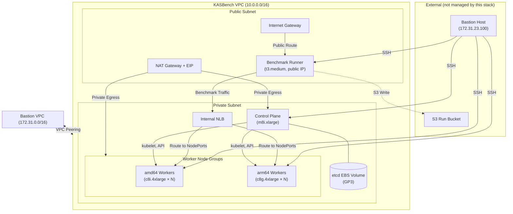

```mermaid
graph TB
    subgraph External["External (not managed by this stack)"]
        Bastion["Bastion Host<br/>(172.31.23.100)"]
        S3["S3 Run Bucket"]
    end

    subgraph BastionVPC["Bastion VPC (172.31.0.0/16)"]
        Bastion
    end

    subgraph VPC["KASBench VPC (10.0.0.0/16)"]
        subgraph Public["Public Subnet"]
            IGW["Internet Gateway"]
            NAT["NAT Gateway + EIP"]
            Runner["Benchmark Runner<br/>(t3.medium, public IP)"]
        end

        subgraph Private["Private Subnet"]
            CP["Control Plane<br/>(m8i.xlarge)"]
            EtcdVol[("etcd EBS Volume<br/>(GP3)")]
            subgraph Workers["Worker Node Groups"]
                AMD64["amd64 Workers<br/>(c8i.4xlarge × N)"]
                ARM64["arm64 Workers<br/>(c8g.4xlarge × N)"]
            end
            NLB["Internal NLB"]
        end
    end

    BastionVPC <-->|VPC Peering| VPC

    Bastion -->|SSH| Runner
    Bastion -->|SSH| CP
    Bastion -->|SSH| AMD64
    Bastion -->|SSH| ARM64

    Runner -->|Benchmark Traffic| NLB
    NLB -->|Route to NodePorts| AMD64
    NLB -->|Route to NodePorts| ARM64

    CP --- EtcdVol
    CP -->|kubelet, API| AMD64
    CP -->|kubelet, API| ARM64

    IGW -->|Public Route| Runner
    NAT -->|Private Egress| CP
    NAT -->|Private Egress| Workers

    Runner -.->|S3 Write| S3
```