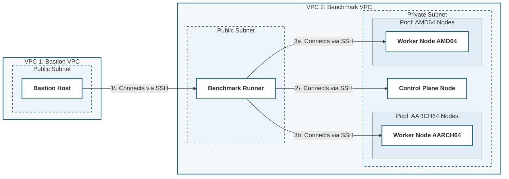

# Requirement 1: Baseline Development

## Background

- KASBench is a benchmark for Kubernetes autoscaling
- Every benchmark trial creates a new Kubernetes environment in AWS using Open Tofu.  A benchmark run contains at least 7 trials per autoscaler under test.
- This program, the KASBench Controller, is responsible for orchestrating the benchmark execution.
- The Benchmark Controller is a command line program.  All operations are controlled via the command line.
- THe Benchmark Controller will run on the Bastion Host.  See the Overview section below.
- Command line operations include individiual operations, like `build-infrastructure` and `clean`, as well as operations like `run-benchmark` that combine multiple individual operations into a comprehensive workflow.
- This requirement includes the  `init` and `build-infrastructure` flows.  Other flows will be added in subsequent requirements.
- As a benchmark, the results of the execution of this controller must be auditable.  The program should be very explicit about reporting each step that was taken and the output, regardless of success or failure.  In the case of failures, the error code and message should be explicitly reported.  Each log entry should begin with a timestamp.  Start and end times should also be reported.
- If the user supplies a `--log filename` argument, the log should be rendered to a file in addition to the console.  The log should be in structured logging format following best practices.
- The program shoud have a `--dry-run` option that says what it would do, but doesn't actually perform the operations.
- The program will be written in Python.  Use `uv` as the package manager.  I have already performed `uv init`.


## Overview

The following figure presents a high level view of the AWS infrastructure to be created.  VPC 1 and the bastion host are pre-existing.  This step creates "VPC 2" and everything in it.  See the [Architecture Overview](architecture_overview.md) document for more details.  This program run on the Bastion Host and has permissions to SSH to the host in the public subnet.  From there, it can SSH to the hosts in the private subnet.


    



## Directory Structure

Data will be stored on the bastion host in the following directory structure.

```
├── working-directory                       # The working directory (ex. /data)
    ├── run-identifier                      # The run directory (ex. /data/run001)
        benchmark.db                        # SQLite database containing data from the benchmark run
        ├── trial-identifier                # The trial directory (ex. /data/run001/trial001)
            ├── output                      # Outputfrom the benchmark run (ex. /data/run001/trial001/output)
            ├── benchmark-infrastructure    # The Open Tofu directory.  Contains Open Tofu HCL and state
                LICENSE
                README.md
                main.tf
                outputs.tf
                providers.tf
                ssh_key.tf
                variables.tf
                versions.tf
                ├── artifacts
                ├── environments            # The environments directory
                    benchmark.tfvars
                    small-test.tfvars
                    small.tfvars
                ├── modules

```


## Flows


### 1. The `init` flow

- This process is invoked from the command line with the `init` argument.  It is used to start a new experimental run.  It is potentially destructive.  Artificats from prior experiments may be deleted.  The following command line options are mandatory when running `init`:
    - `--working-directory`: The top directory where all data created by this program is maintained.  It will be created if it doesn't exist.
    - `--run-identifier`: A text string used to identify this run of the benchmark.  Data will be stored in a directory formed by concatenating working-directory and benchmark-run-identifier.  For example, if working-directory is "/data" and identifier is "run001", data will be stored in "/data/run001".  This directory will be referred to as the "run directory" in this document.  If the run directory exists and the --force flag is not set, the program will exit with a non-zero return code and appropriate error message.  If it exists and the --force flag is set, it will be deleted.   The run directory will be created or re-created automatically.  If the run directory cannot be created, the program terminates with a non-zero return code and appropriate detailed error message.
    - `--force`: If this command is supplied, a pre-existing run directory will be silently destroyed without prompting the user.
- A SQLite database (benchmark.db) will be created in the run directory with the following tables:
    - Table: trials
        - trial_id, int, not null, identity, unique, primary key
        - status, text, not null.  Possible values: PENDING, INIT, RUNNING, CLEANUP, SUCCESS, FAIL, TERMINATED, UNKNOWN.  Default is PENDING
        - run_identifier: text, null.  Application assigned run identifier.
        - trial_identifier: text, null.  Application assigned trial identifier.
        - autoscaler, text, not null
        - record_created_time, datetime, not null, default to current time
        - benchmark_runner_public_ip: text, null.  Public IP address of the benchmark runner host. 
        - ssh_key_pair_name, text, null.  The key pair name.
        - last_update_time, not null, default to current time
        - infra_start_time, datetime, null.  The time `build-infrastructure` starts.
        - infra_end_time, datetime, null. The time `build-infrastructure` ends.
        - cleanup_start_time, datetime, null.  The time the `cleanup` process starts.
        - cleanup_end_time, datetime, null. The time the `cleanup` process ends.
        - benchmark_start_time, datetime, null.  The time the `run_benchmark` process starts.
        - benchmark_end_time, datetime, null.  The time the `run_benchmark` process ends.
        - unresponsive_checks, int, not null. Default is 0.  During the benchmark process, this program will periodically check the status of the Benchmark Runner.  If the benchmark runner does not respond, this column will be incremented by 1.  When it does respond, this column will be reset to 0.
    - Table: events
        - event_id: int, not null, identity, unique, primary key
        - trial_id: int, not null, foreign key to trials.trial_id
        - event_time: datetime, not null, default to current timestamp
        - event_type: text, not null
        - event_request: text, null
        - event_message: text, null
- If any steps fail, abort processing and return a non-zero return code and detailed error message.  If the process runs to completion, return 0.


### 2. The `build-infrastructure` flow

- This process is invoked from the command line with the `build-infrastructure` argument.  The following command line options are available:
    - `--working-dir`: This must be a directory previously created through the init process (mandatory).    
    - `--run-identifier`: A text string used to identify this run of the benchmark. Must have been previously initialized (mandatory).
    - `--trial-identifier`: A text string used to identify this trial (mandatory).
    - `--autoscaler': A text string used to identify the autoscaler under test (mandatory).
    - `--auto-approve`: If supplied, automatically approve the apply without prompting the user to approve.
    - `--var-file`: a tfvars file to be used with the call to `tofu apply`.  This argument may appear more than once. Optional. 
    -  `--var`: a variable name-value pair (e.g., "environment=production").  This argument may appear more than one. Optional.
    - `--force`: If this argument is supplied, a pre-existing trial directory will be deleted.  Optional.
    - `--no-apply`: If this argument is supplied, the `tofu apply` step will be skipped.
- Validate that the run directory formed by concatening the working directory and the benchmark-run-identifier exists, contains a valid SQLite database benchmark.db, and contains the expected subdirectory (see `init` flow).
- Validate that the trial directory formed by concatening the run directory with the trial-identifier does not exist.  If it does and the --force flag is supplied, remove it.  If it does and the --force flag is not supplied, exit with a non-zero return code and appropriate message. 
- Create the trial directory.
- Get the head of the main branch of https://github.com/kasbench/benchmark-infrastructure and store it in the the benchmark-infrastructure subdirectory of the trial directory.  This will be referred to as the Open Tofu directory.  This operation can be done with git, curl, wget, or Python requests.  Git tracking of the downloaded directory is not necessary.  We will not be putting changes back to GitHub.  The contents of the repo should be in the trial director/benchmark-infrastructure directory.  There should not be an intermediate or extra subdirectory.
- Delete the following from the benchmark-infrastructure directory:
    - The .kiro subdirectory (recursive delete)
    - The requirements subdirectory
    - .gitignore
    - .git (if it exists)
- Create an `output` subdirectory under the trial directory
- Insert a record into benchmark.db with the following mapping.  Capture the trial_id generated upon insert, as it will be used in a subsequent step.
    
    | Column | Mapping | 
    | --- | --- |
    | status | PENDING |
    | run_identifier | run-identifier from command line |
    | trial_identifier | trial-identifier from command line |
    | autoscaler | autoscaler from command line |
    | record_created_time | current timestamp |
    | last_update_time | current timestamp |
- Perform `tofu init` in the Open Tofu directory using TofuPy or by calling `tofu` directly.
- If the `--no-apply` flag is set, exit here with zero return code and a message indicating that the process is stopping early because of the `--no-apply` flag.
- Perform `tofu apply` in the Open Tofu directory using TofuPy or by calling `tofu` directly.  Pass arguments in the following order:
    - The files specified with `--var-file` in the order in which they are specified.  If only the name of the variable file is specified, it will be assumed to be in the environments directory (the environments subdirectory of the Open Tofu directory).  Othewise, the file will be assumed to be in the location specified by the user.  
    - The variables specified by the `--var` argument
    - The  trial-identifer from the command line will be passed as variable "run_id"
    - If the `--auto-approve` argument was supplied, pass `-auto-approve` to Open Tofu.  Otherwise, display the plan to the user and prompt for approval.  If the user does not approve, exit with a non-zero return code.
- Capture the outputs from the Open Tofu apply and write it to a new file in the output subdirectory of the trial directory.  The file [examples/kasbench_infra_outputs.json](examples/kasbench_infra_outputs.json) is an example of what the output might look like, depending upon the configuration.  The files in [examples/trial001](example/trial001) show what will appear in the kasbench-controller/artifacts directory (replace trial001) with the run-identifier. 
- If the result of the apply is not successful, exit immediately with a non-zero return code and appropriate error message.      
- Update the the database record for the saved trial_id with the following.  Assume that the JSON output from the apply is stored in a variable called "output".

    | Column | Mapping | 
    | --- | --- |
    | status | INIT |
    | benchmark_runner_public_dns | output["benchmark_runner"]["public_ip"] from the JSON output from the apply command.
    | ssh_key_pair_name | output["ssh_key_pair_name"]
    | last_update_time | current timestamp |
    | infra_start_time | current timestamp |
- If no errors were encountered, return with a zero return code.

